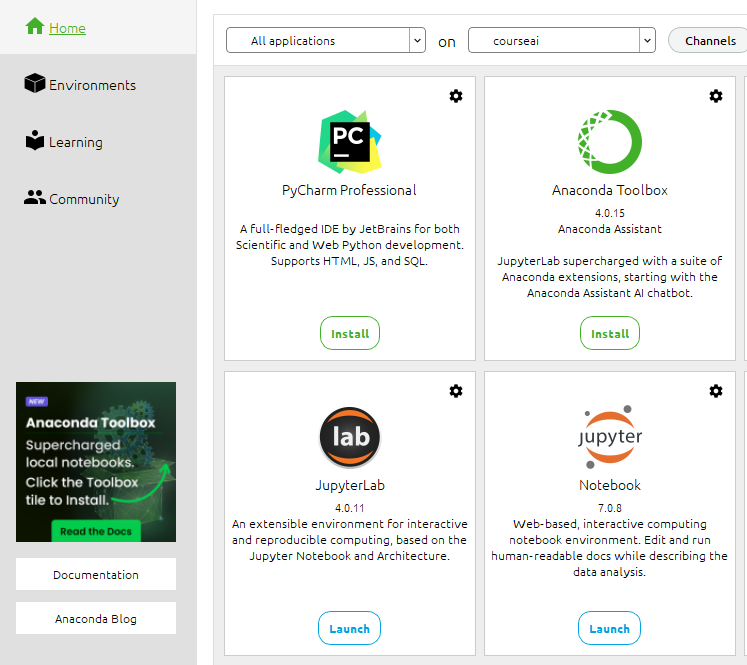

# Análise de Dados e Aprendizado de Máquina Aplicados ao Judiciário

Bem-vindo ao curso de Análise de Dados e Aprendizado de Máquina Aplicados ao Judiciário! Este repositório contém todo o material necessário para acompanhar as aulas, incluindo códigos, datasets, slides e referências adicionais. Ele ficará disponível durante todo o período de estudos.

O objetivo deste curso não é explorar a imensa variedade de algoritmos, frameworks e técnicas de Análise de Dados e Aprendizado de Máquina, mas sim apresentar o processo de construção de aplicações de Inteligência Artificial (IA) que sirvam como um referencial para desenvolver uma solução que se adapte melhor ao problema a ser resolvido.

Para acompanhar o curso, é necessário ter a linguagem Python instalada na sua máquina e uma IDE como VSCode ou Anaconda Navigator. Você também pode usar o ambiente Google Colab (https://colab.research.google.com) para testar e modificar os códigos. Aliás, alguns dos nossos exemplos serão feitos especificamente para essa plataforma. No entanto, vamos usar muito o Anaconda Navigator nos exemplos de aula. Caso queira simular de forma igual, aconselho criar diferentes **Environments** no Anaconda (Environments >> Create) para cada unidade, pois os pacotes por vezes são conflitantes.

Crie pelo menos dois **Environments**: um com o Python 3.12 e outro com o Python 3.11. Na figura, eu criei o **Environment autoML** com o Python 3.11, pois algumas dependências do Pycaret não executarão em uma versão superior.

Depois de criar o ambiente, selecione-o e em **Home** escolha **Jupyter Notebook**. Talvez seja necessário instalá-lo antes. Ele vai abrir no navegador. Basta agora, na opção **New**, criar o **Notebook**, mas no nosso caso, como os códigos já estão prontos, escolha a pasta onde os colocou e abra o Notebook (arquivo .ipynb) que deseja executar.

Nos arquivos Jupyter Notebook de cada unidade, você encontra o que é necessário instalar e configurar para executar o código. Cada Notebook terá instruções sobre pacotes que precisarão ser instalados antes; basta executar a célula. Algo parecido com `!pip install pandas`.

É muito importante que antes de cada aula o seu ambiente esteja configurado e os pacotes instalados, para que consiga executar os exemplos em tempo real. Alguns pacotes demoram para ser instalados.

Caso não queira instalar/configurar esse ambiente em sua máquina, utilize o Google Colab. Apenas faça upload dos arquivos e pastas para o Colab. É possível linkar o Colab com o GitHub.

Apenas como uma provocação, este é um vídeo que fiz (sem muitos cuidados estéticos ou zelo) usando as plataformas da Synthesia e OpenAI para testar como a IA poderia me ajudar no trabalho. A definição do conteúdo a ser abordado, os slides, as imagens, o roteiro, o avatar e a voz foram todos criados com a ajuda da Inteligência Artificial.

Abaixo está a descrição do conteúdo abordado em cada unidade.

**UNIDADE 1: Inteligência Artificial**

1.1. Fundamentos do Aprendizado de Máquina  
1.2. Tipos de Tarefas de Aprendizado  
  1.2.1. Supervisionado  
  1.2.2. Não supervisionado  
  1.2.3. Semi supervisionado  
  1.2.4. Aprendizado por reforço  
1.3. Modelagem preditiva  

**UNIDADE 2: Tratamento dos Dados**

2.1. Análise exploratória de dados (EDA)  
2.2. Limpeza de dados  
2.3. Transformação de dados  
  2.3.1. Divisão dos dados  
  2.3.2. Balanceamento  
  2.3.3. Escalonamento  
  2.3.4. Codificação e criação de features  
2.4. Redução de dimensionalidade  

**UNIDADE 3: Regressão Linear**

3.1. Previsões simples (Regressão linear)  
3.2. Previsões complexas (Regressão linear múltipla)  
3.3. Algoritmos de Classificação  
  3.3.1. Métodos simbólicos: Árvore de Decisão  
  3.3.2. Métodos ensemble: Random Forest  

**UNIDADE 4: Otimização e Desempenho**

4.1. Otimização de hiperparâmetros e regularização  
  4.1.1. Técnicas de avaliação de modelos  
    4.1.1.1. Overfitting e underfitting  
    4.1.1.2. Interpretabilidade dos modelos  
    4.1.1.3. Questões éticas e de viés  
  4.1.2. Validação cruzada  
  4.1.3. GridSearchCV  
  4.1.4. Avaliação de métricas  

**UNIDADE 5: Redes Neurais**

5.1. Estrutura básica de uma rede neural  
5.2. Arquitetura de redes neurais  
  5.2.1. Perceptron  
  5.2.2. Multilayer Perceptron  
5.3. Treinamento de redes neurais  
  5.3.1. Algoritmos de retropropagação  
  5.3.2. Otimização de pesos  
  5.3.3. Função de ativação  
5.4. Arquiteturas de Redes Neurais Profundas  

**UNIDADE 6: Large Language Models**

6.1. Redes Neurais Generativas (GAN)  
6.2. Conceitos de Processamento de Linguagem Natural  
6.3. Principais modelos LLM  
  6.3.1. Open AI  
  6.3.2. Llama  

**UNIDADE 7: Treinando Modelos LLMs**

7.1. Retrieval Augmented Generation  
7.2. Framework LangChain  
7.3. Llama 3  
