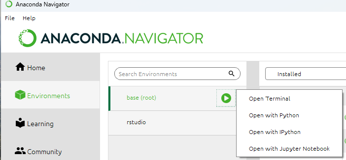
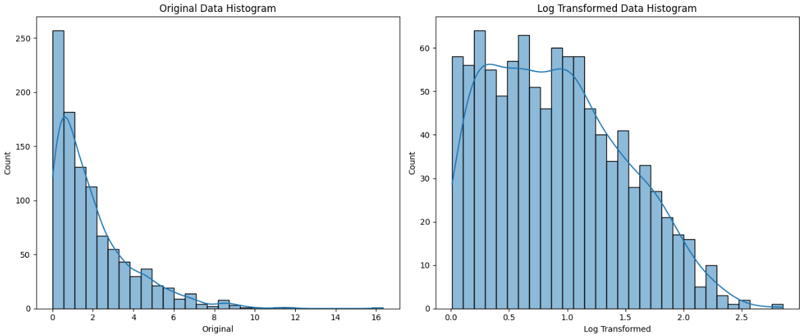
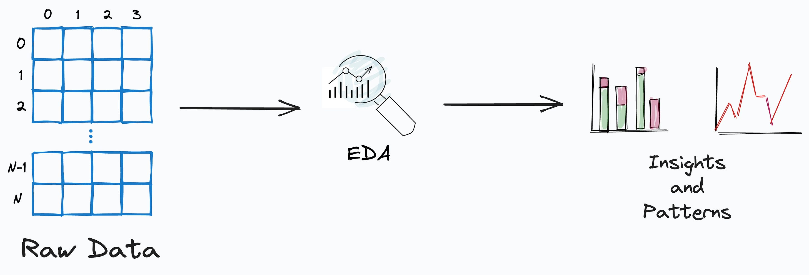
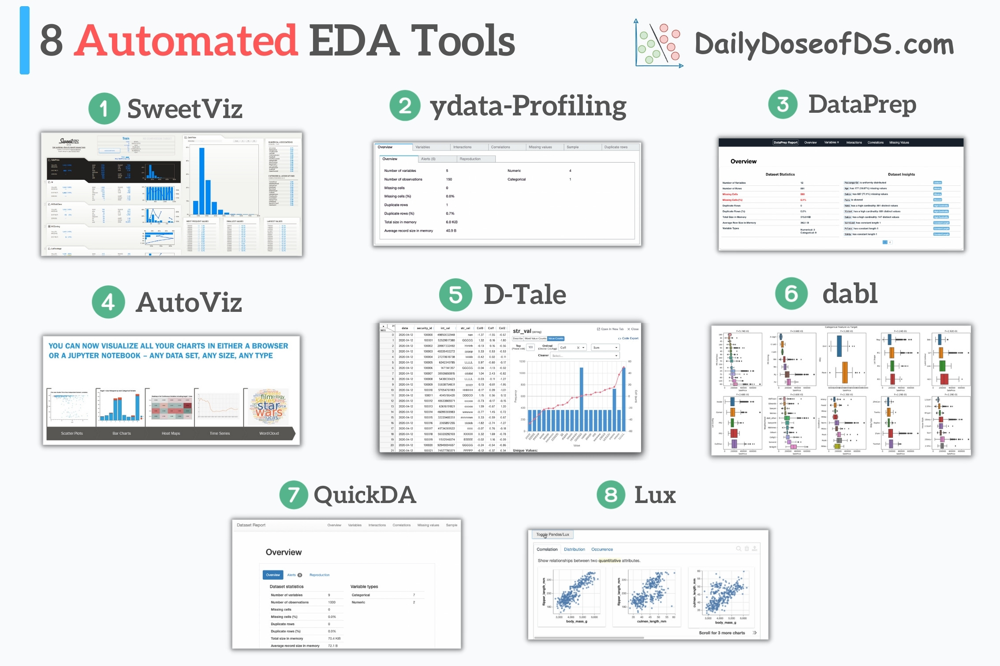

# UNIDADE 2: Tratamento dos dados

2.1. Análise exploratória de dados (EDA)

2.2. Limpeza de dados

2.3. Transformação de dados

2.3.1. Divisão dos dados

2.3.2. Balanceamento

2.3.3. Escalonamento

2.3.4. Codificação e criação de features

2.4. Redução de dimensionalidade

# Preparação para a aula:
É importante que o ambiente esteja preparado antes da aula. No ambiente Colab apenas execute os notebooks instalando antes os pacotes:

```
!pip install ydata-profiling
!pip install sweetviz
```

**Se entiver usando o Jupyter Notebook (Ambiente Anaconda Navigator Windows/Linux)**: talvez tenha que instalar os pacotes.    
```
!pip install ydata-profiling
!pip install sweetviz
!pip install joblib
!pip install plotly
```

Tente importar as bibliotecas:

```
import pandas as pd
import numpy as np
from sklearn import preprocessing
from sklearn.preprocessing import MinMaxScaler
from sklearn.preprocessing import StandardScaler
from sklearn.impute import SimpleImputer
import joblib
from tqdm import tqdm
tqdm.pandas()
import seaborn as sns
import matplotlib.cm as cm
import matplotlib.pyplot as plt
import plotly.express as px
import plotly.graph_objects as go
import plotly.figure_factory as ff
from plotly.subplots import make_subplots
import sweetviz as sv
from ydata_profiling import ProfileReport
```

Caso tenha problemas de dependências ao importar ydata-profiling, force a atualização dos pacotes.

Vá ao ao terminal do Anaconda Navigator: Enviroments>selecionar o enviroment que estiver executando>>OpenTerminal e digitar os comandos:





```
pip uninstall numba visions ydata_profiling joblib 
conda update conda
conda update charset-normalizer jsonpatch packaging
conda install -c conda-forge ydata-profiling
```

## Análise exploratória de dados (EDA)
A Análise Exploratória de Dados (EDA) é um processo crucial para entender a estrutura, características e padrões dos dados brutos. Utilizando técnicas estatísticas e visualizações gráficas, a EDA ajuda a identificar outliers, tendências, distribuições e possíveis relações entre variáveis. Esse passo inicial é fundamental para guiar futuras etapas de modelagem e análise.

[Ver exemplo de script de limpeza e transformação](./notebooks/ExTransformacaoLimpeza.ipynb)

### Limpeza e transformação de dados

A limpeza e transformação de dados são passos que garantem a qualidade e a usabilidade dos dados para análises e modelagens subsequentes. Essas etapas ajudam a eliminar ruídos, melhorar a precisão dos modelos.

#### Limpeza de Dados

A limpeza de dados envolve a identificação e correção de inconsistências, erros e valores ausentes nos dados. Esse processo pode incluir a remoção de duplicatas, tratamento de valores nulos, correção de erros tipográficos e ajuste de formatos inconsistentes. A limpeza de dados é essencial para garantir a integridade e a qualidade dos dados antes da análise ou modelagem.

1. **Tratamento de Ausentes**:
    - **Remoção de Linhas/Colunas**: Linhas ou colunas com muitos valores ausentes podem ser removidas.
    - **Imputação**: Valores ausentes podem ser substituídos por valores como a média, mediana, moda ou valores derivados de métodos mais sofisticados, como K-Nearest Neighbors.

```python
# Tratamento de valores ausentes
df.fillna(df.mean(), inplace=True)

# Remoção de linhas com muitos valores ausentes
df.dropna(thresh=len(df.columns) - 2, inplace=True)

# Imputação com média
df['coluna_interesse'].fillna(df['coluna_interesse'].mean(), inplace=True)

# Imputação com mediana
df['coluna_interesse'].fillna(df['coluna_interesse'].median(), inplace=True)

# Imputação com moda
df['coluna_interesse'].fillna(df['coluna_interesse'].mode()[0], inplace=True)
```


2. **Remoção de Duplicatas**:
    - Identificação e remoção de registros duplicados para evitar a contagem redundante de dados.

```python
# Identificação e remoção de duplicatas
df.drop_duplicates(inplace=True)
```

3. **Correção de Valores Anômalos (Outliers)**:
    - **Remoção**: Outliers que são claramente erros podem ser removidos.
    - **Transformação**: Aplicação de transformações como logarítmica para reduzir o impacto de outliers.
    - **Substituição**: Substituir outliers por valores que estejam dentro de um intervalo aceitável.

4. **Correção de Erros de Digitação**:
    - Identificação e correção de valores que foram inseridos incorretamente devido a erros de digitação ou inconsistências de formato.

```python
# Correção de valores incorretos
df['coluna_texto'] = df['coluna_texto'].str.replace('erro', 'correto')
```

5. **Correção de Inconsistências de Formato**:
    - Uniformização de formatos de datas, unidades de medida e padrões de texto para garantir a consistência dos dados.

#### Transformação de Dados

A transformação de dados refere-se à modificação dos dados brutos em um formato adequado para a análise ou modelagem. Esse processo pode incluir várias etapas, como a divisão dos dados, balanceamento, escalonamento e codificação.

1. **Divisão dos dados**:
A divisão dos dados envolve separar o conjunto de dados em subconjuntos, geralmente em dados de treino e teste. Isso permite avaliar o desempenho dos modelos em dados não vistos durante o treinamento, ajudando a prevenir o overfitting e a garantir a generalização do modelo.

```python
from sklearn.model_selection import train_test_split
X_train, X_test, y_train, y_test = train_test_split(X, y, test_size=0.2, random_state=42)
```

3. **Balanceamento**:
O balanceamento de dados é necessário quando há uma distribuição desigual entre as classes em problemas de classificação. Técnicas como oversampling, undersampling e geração de novos exemplos sintéticos são usadas para equilibrar a distribuição das classes e melhorar a performance

```python
from imblearn.over_sampling import SMOTE
smote = SMOTE(random_state=42)
X_res, y_res = smote.fit_resample(X_train, y_train)
```

5. **Codificação de Variáveis Categóricas**:
    - **Label Encoding**: Converte categorias em valores numéricos.
    - **One-Hot Encoding**: Cria colunas binárias para cada categoria, indicando a presença ou ausência da categoria.

```python
# One-Hot Encoding
df = pd.get_dummies(df, columns=['coluna_categorica'])
```

6. **Criação de Novas Features (Feature Engineering)**:
    - **Combinação de Variáveis**: Criar novas variáveis combinando variáveis existentes.
    - **Transformações Matemáticas**: Aplicação de transformações como logaritmo, raiz quadrada ou quadrado para criar novas features.

```python
# Criação de nova feature
df['nova_feature'] = df['feature1'] * df['feature2']
```

7. **Transformação Logarítmica**:
    - Aplicada para reduzir a variação em dados altamente dispersos e trazer a distribuição mais próxima de uma distribuição normal. A transformação logarítmica pode comprimir a escala dos dados, facilitando a interpretação de gráficos e análises, bem como pode reduzir essa assimetria, tornando a distribuição mais simétrica e, frequentemente, mais próxima de uma distribuição normal, o que melhora o ajuste do modelo e a precisão das previsões.

```python
# Gera um dataset skewed
np.random.seed(42)
data = np.random.exponential(scale=2, size=1000)  # Exponential distribution is often skewed
# Aplica a transfomação
df = pd.DataFrame({'Original': data, 'Log Transformed': np.log1p(data)})
```
  


[Ver exemplo de script de transformação logarítimica](./notebooks/ExTransformacaoLogaritmica.ipynb)

6. **Detecção e Tratamento de Outliers**:
    - Aplicar métodos como o desvio interquartil ou z-score para identificar e tratar valores que se afastam significativamente dos demais dados.

7. **Agregação de Dados**:
    - Resumir dados detalhados em dados agregados, por exemplo, transformando dados diários em dados mensais para análise em nível superior.

8. **Transformações Baseadas em Domínio**:
    - Transformações específicas baseadas no conhecimento do domínio, como transformar vari modelos e fornecer uma base sólida para a tomada de decisões baseada em dados.

9. **Redução de dimensionalidade**:
A redução de dimensionalidade é o processo de reduzir o número de variáveis (features) em um conjunto de dados, preservando ao máximo a variabilidade e a informação. Técnicas como Análise de Componentes Principais (PCA) e Análise Discriminante Linear (LDA) são utilizadas para simplificar os dados, melhorar a performance dos modelos e reduzir o tempo de processamento.

```python
from sklearn.decomposition import PCA
pca = PCA(n_components=2)
X_pca = pca.fit_transform(X_train_scaled)
```

10. **Escalonamento de Variáveis**:
    - **Z-Score Scaling (Padronização)**: Escala os dados com base na média e desvio padrão. Use quando for necessário comparar dados com diferentes escalas ou unidades, centralizando os dados em torno de uma média de 0 e um desvio padrão de 1.
    - **Min-Max Scaling (Normalização)**: Escala os dados para que fiquem entre um intervalo específico.  Utilize quando precisar que seus dados estejam em uma faixa específica, como 0 a 1, mantendo a proporcionalidade entre os valores.

#### Padronização (Z-score Scaling)

Padronização é o processo de transformar os dados para que tenham uma média de 0 e um desvio padrão de 1. Isso é útil quando você quer comparar dados que podem ter diferentes escalas ou unidades. Após a padronização, os dados seguem uma distribuição normal padrão.

A fórmula para padronização é:

$z = \frac{x - \mu}{\sigma}$

```python
from sklearn.preprocessing import StandardScaler
scaler = StandardScaler()
df['coluna_padronizada'] = scaler.fit_transform(df[['coluna_interesse']])
```

#### Normalização (Min-Max Scaling)

Normalização é o processo de transformar os dados para que fiquem em uma faixa específica, geralmente entre 0 e 1. Esse método é útil quando você quer manter a proporcionalidade dos dados, ou seja, o relacionamento entre os valores permanece o mesmo.

A fórmula para normalização é:

$z = \frac{x - \min(x)}{\max(x) - \min(x)}$

```python
from sklearn.preprocessing import MinMaxScaler
scaler = MinMaxScaler()
df['coluna_normalizada'] = scaler.fit_transform(df[['coluna_interesse']])
```


### Ferramenta de análise de dados
Algumas bibliotecas permitem a criação de relatórios exploratórios completos para um DataFrame do pandas. O relatório inclui informações sobre distribuição de variáveis, estatísticas descritivas, correlações, valores ausentes, entre outros.




Fonte: AVI CHAWLA, Daily Dose of Data Science


As ferramentas de EDA que automatizam muitas etapas redundantes de EDA e ajudam a perfilar seus dados rapidamente. Essas ferramentas não são as alternativas definitivas de EDA que responderão a todas as suas perguntas sobre o conjunto de dados. Mas, considerando que as etapas preliminares de EDA em quase todos os projetos são as mesmas — plotar a variável de resposta, verificar o desbalanceamento, realizar análise de correlação, análise de valores ausentes e mais, essas ferramentas automatizam muito bem essas etapas.


Sweetviz é uma biblioteca de EDA que gera relatórios detalhados e interativos de forma rápida. Existem outras alternativas como: Pandas-profiling, DataPrep, AutoViz, D-Tale, dabl, QuickDA, Lux etc.




Fonte: AVI CHAWLA, Daily Dose of Data Science

# Bibliografia para aprofundar

- Sicus, Abraham Laredo, Smartini, André Samartini, Barth, Nelson Lerner. TÉCNICAS DE MACHINE LEARNING, Brucher, 2023 [Link para Amostra](chrome-extension://efaidnbmnnnibpcajpcglclefindmkaj/https://storage.blucher.com.br/book/pdf_preview/9786555063967-amostra.pdf)

- Grus, Joel. Data Science do Zero. O´Reilly, 2021.
  
 
