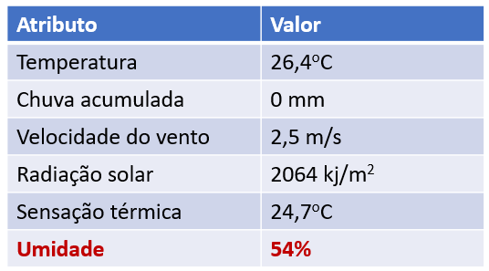
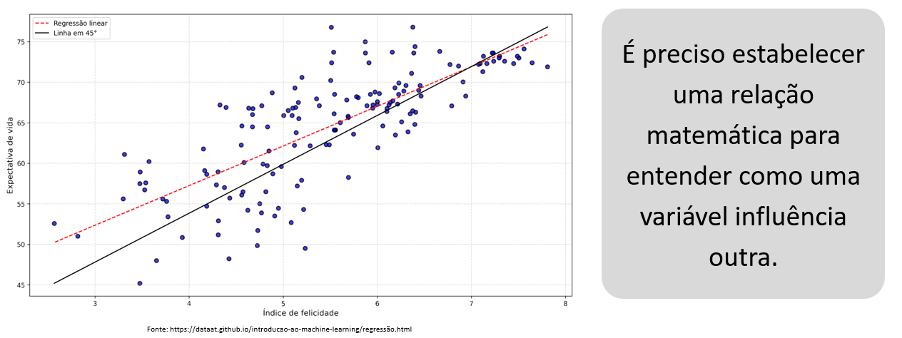

# UNIDADE 3:  Regressão Linear

3.1 Previsões simples (Regressão linear)

3.2 Previsões complexas (Regressão linear múltipla)

3.3   Algoritmos de Classificação

3.3.1 Métodos simbólicos: Árvore de Decisão

3.3.2 Métodos ensemble: Random Forest

### Cenário: determinar a associação entre duas (ou mais) informações

-   Relação entre índice de felicidade e expectativa de vida
-   Relação entre consumo e renda
-   Variáveis relacionadas são ditas correlacionadas
-   Relação (tendência) positiva ou negativa

<blockquote> 
Exemplo de variáveis que aparentemente não são relacionadas:
   
    -   Relação entre a altura de uma criança e a de seus pais
    -   Relação entre cor dos olhos e comprimento dos cabelos
</blockquote>

### Para que serve descobrir a relação entre variáveis?

Para fazer previsões sobre o comportamento futuro do fenômeno

* Quantificar a força e a direção do relacionamento
* Prever uma variável usando o conhecimento sobre a outra variável
  * Prever a **população** de uma cidade em 30 *anos*
  * Prever o índice de *natalidade* infantil no ano 2050
  * Prever a *demanda* futura por habitação
  * Prever o índice de *empregabilidade*
   
* Para simular os efeitos de uma variável sobre outra
  * Simular o efeito sobre o **trânsito** de uma cidade em função da elevação do *preço* da gasolina

### Regresão linear

* Verificação se duas ou mais variáveis estão relacionadas, como se influenciam.
* A regressão linear produz uma previsão numérica, como base em valores conhecidos.

<blockquote> 
<b>Exemplo de regressão</b>: Umidade relativa média do ar sendo influenciada pela temperatura, chuva, vento, radiação solar, sensação térmica. 
</blockquote>

A **regressão linear** é uma técnica estatística utilizada para modelar e analisar a **relação** entre uma variável dependente (resposta) e uma ou mais variáveis independentes (preditores). O objetivo é ajustar uma linha reta (ou hiperplano, no caso de múltiplas variáveis) aos dados observados, de forma a minimizar o erro. 

Isso permite prever o valor da variável dependente com base nos valores das variáveis independentes, identificando **tendências e relações** entre as variáveis analisadas.

$𝑦= 𝑤_0+ 𝑤_1 𝑥_1+𝑤_2 𝑥_2+𝑤_3 𝑥_3+𝑤_4 𝑥_4+…$

* Variável **dependente** $(y)$
* Vetor de **características** (independentes) $(x_1, x_2,..., x_n)$
* As ponderações da função linear $(w_1, w_2,..., w_n)$ são os **parâmetros**
* A ponderação $w_0$ é a **intersecção**

  <h3 style="margin-top: 0;">Ajustar o modelo significa encontrar um bom conjunto de ponderações das características</h3>
  
Quanto maior a magnitude da ponderação mais importante é a característica para o modelo.

### Regressão Linear Simples

A regressão linear simples envolve apenas duas variáveis: uma variável dependente e uma variável independente. O objetivo é encontrar a melhor linha reta que descreva a relação entre essas duas variáveis.

### Regressão Linear Múltipla

A regressão linear múltipla envolve uma variável dependente e duas ou mais variáveis independentes. Esse método é utilizado quando acreditamos que a variável dependente é influenciada por mais de um fator.

### Exemplo de Regressão Linear Simples
 Suponha que estamos interessados em entender a relação entre o número de horas de estudo e a nota obtida em um exame:

$𝑦= 𝑤_0+ 𝑤_1 𝑥$

Onde:

* y é a variável dependente (nota no exame)
* x é a variável independente (horas de estudo)
* $𝑤_0$ é o intercepto (valor de $y$ quando $x = 0$)
* $𝑤_1$ é o coeficiente de inclinação (quanto $y$ muda para cada unidade adicionada a $x$)

### Exemplo com Valores

Vamos usar alguns dados hipotéticos:

| Horas de Estudo (x) | Nota no Exame (y) |
|--------------------------|-------------------------|
| 1                        | 2                       |
| 2                        | 4                       |
| 3                        | 5                       |
| 4                        | 4                       |
| 5                        | 5                       |

Suponha que, ao aplicar a regressão linear aos dados acima, obtemos os seguintes valores estimados para os coeficientes:

- Intercepto $w_0$: 1.4
- Coeficiente de inclinação $w_1$: 0.8

Assim, a equação da regressão linear para prever a nota com base nas horas de estudo é:

$𝑦 = 1.4 + 0.8 𝑥$

### Previsão com a Equação

Podemos usar essa equação para prever a nota no exame para diferentes valores de horas de estudo.

Por exemplo:
- Para 3 horas de estudo $x = 3$:

$𝑦 = 1.4 + 0.8 \times 3 = 1.4 + 2.4 = 3.8$

- Para 6 horas de estudo $x = 6$:

$𝑦 = 1.4 + 0.8 \times 6 = 1.4 + 4.8 = 6.2$

