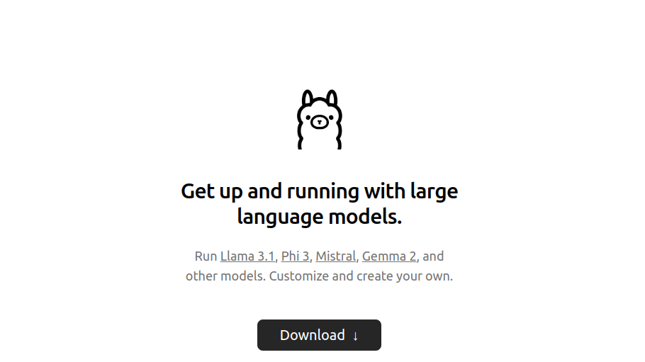
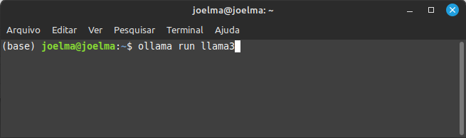
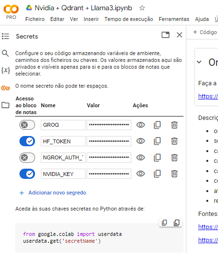
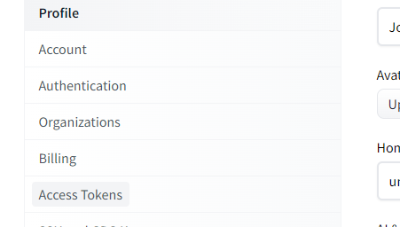
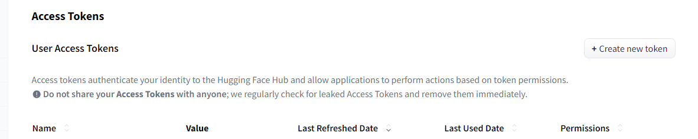
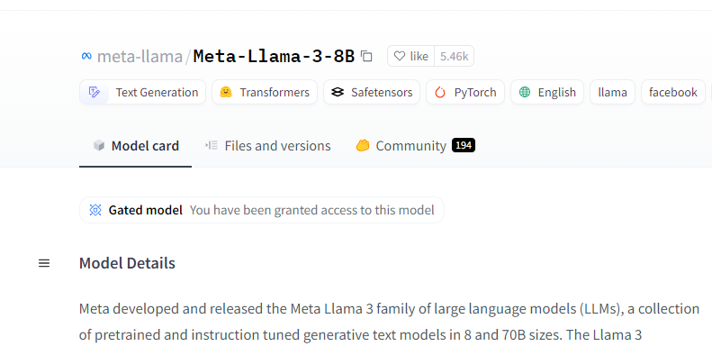

# **UNIDADE 6: Large Language Models**

6.1. Redes Neurais Generativas (GAN)  
6.2. Conceitos de Processamento de Linguagem Natural  
6.3. Principais modelos LLM  
  6.3.1. Open AI  
  6.3.2. Llama  

Para completar essa unidade será preciso instalar um conjunto de novos programas e acessos em sites externos, a depender se for trabalhar LOCAL ou na NUVEM (colab). 

Aconselho fazer as duas configurações LOCAL e NUVEM pois os exemplos práticos são diferentes para cada ambiente. Nas aulas usarei ambos dependendo do exercício.

Primeiramente, se executando LOCAL no Anaconda crie um novo **Environments**  e instale as bibliotecas (necessárias no Colab também)

```
!pip install langchain_core
!pip install langchain_community
!pip install streamlit
!pip install -q groq
!pip install spacy
```

# Caso escolha trabalhar LOCAL: Instale o Ambiente Ollama no projeto Chatbot
  
### Passo 1:

Vá ao site Ollama https://ollama.com/ e faça download conforme o seu ambiente.

Ollama é uma plataforma ou biblioteca que oferece serviços de processamento de linguagem natural, especificamente modelos de linguagem grandes (LLMs) como o modelo "llama3". 



### Passo 2:

Vá ao terminal do seu computador e execute o comando abaixo para carregar o modelo LLM.

ollama run llama3

Para sair /bye



# Caso escolha trabalhar GOOGLE COLAB no projeto Grog+Llama


### Passo 3: Crie sua conta e API Key no Groq

https://console.groq.com/playground

Para usar o LPU e os modelos diretamente no código você vai precisar criar uma **API Key no Groq**.

*   Visite o site da Groq Cloud em console.groq.com e crie uma conta.
*   Faça Login na sua conta e navegue até a seção de API Keys e gere uma Nova Chave de API

### Passo 4: Configure a API Key no Google Colab

Para poder usar a API Key no Google Colab:

*   Abra o Google Colab e vá para Secrets.
*   Digite o Nome e o Valor do segredo. Embora o Valor possa ser alterado, o Nome não pode ser alterado. Neste código o Nome é GROQ, mas você pode alterar
*   Ative o acesso ao Notebook.
*   Finalmente, para usá-lo no notebook, use o código fornecido com o nome do seu segredo no lugar de "\<secretName\>"

  
  
https://medium.com/@parthdasawant/how-to-use-secrets-in-google-colab-450c38e3ec75

# Para o projeto de Fine-tuning

### Passo 1: Crie sua conta e Access Tokens no Hugging Face 

https://huggingface.co/





Para usar usar a API do HugginFace e baixar o Llama3 para fazer ajuste fino você precisará de um **Acess Token**.

*   Visite o site do Hugging Face https://huggingface.co/ e crie uma conta.
*   Faça Login na sua conta e navegue até a Settings>>Access Tokens e gere uma Crie um Novo Token
### Passo 5: No seu Drive do Google crie a pasta LlamaModels

Vamos precisar que os arquivos e modelo sejam armazenados nessa pasta. É necessário ter espaço no Drive para isso

Para poder usar a **Acess Token no Google Colab**:

*   Abra o Google Colab e vá para Secrets.
*   Digite o Nome e o Valor do segredo. Embora o Valor possa ser alterado, o Nome não pode ser alterado. Neste código o Nome é **HF_TOKEN**, mas você pode alterar
*   Ative o acesso ao Notebook.
*   Finalmente, para usá-lo no notebook, use o código fornecido com o nome do seu segredo no lugar de "\<secretName\>"

Escolha o modelo que quer fazer ajuste fino, no nosso caso será o meta-llama/Meta-Llama-3-8B. Vá até a página do Hugging Face para assinar termo de acesso e uso do modelo. Não baixe o modelo de HF sem esse acesso garantido

https://huggingface.co/meta-llama/Meta-Llama-3-8B

  
  
