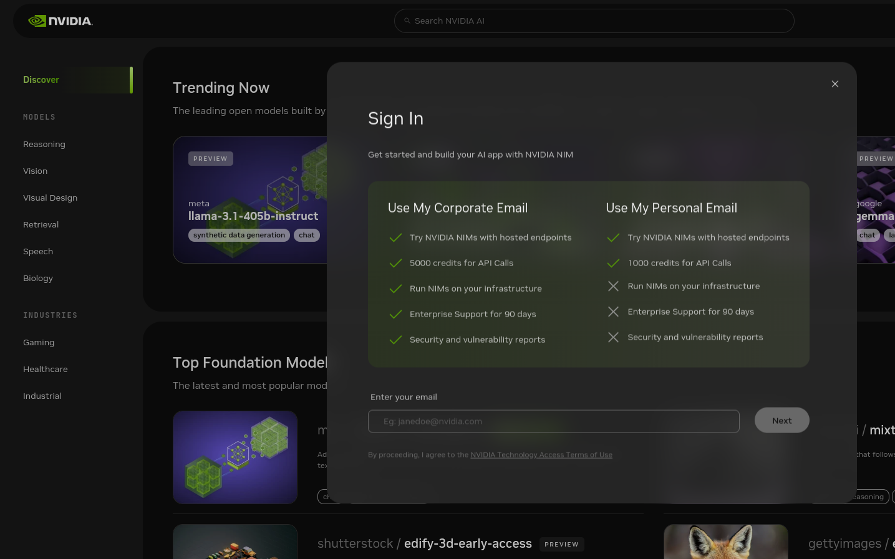
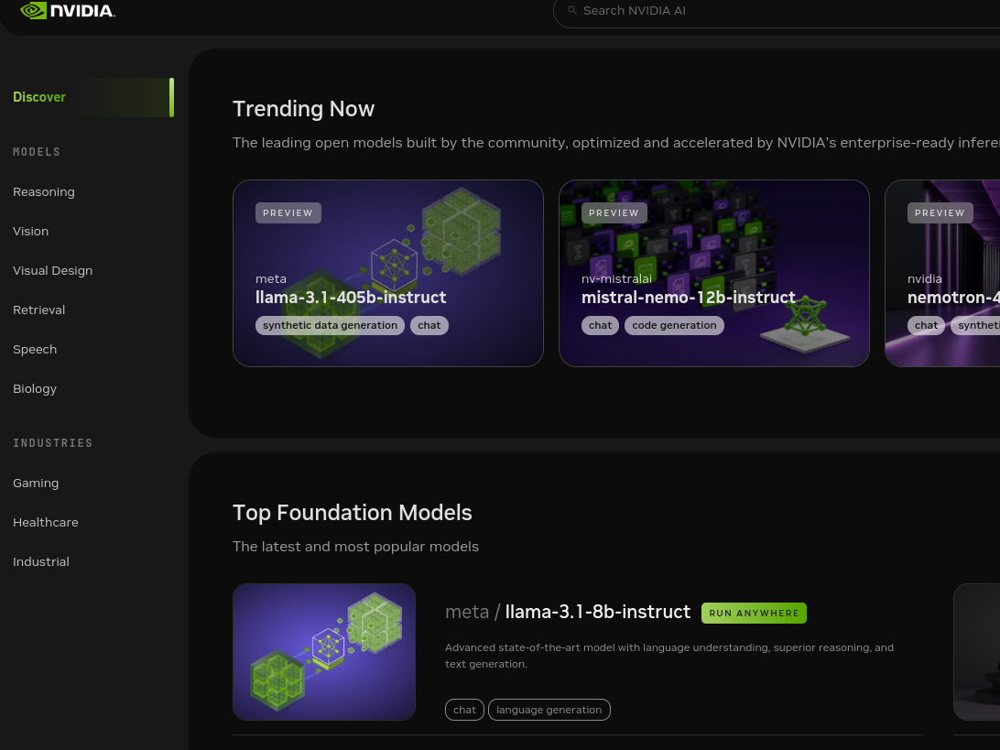
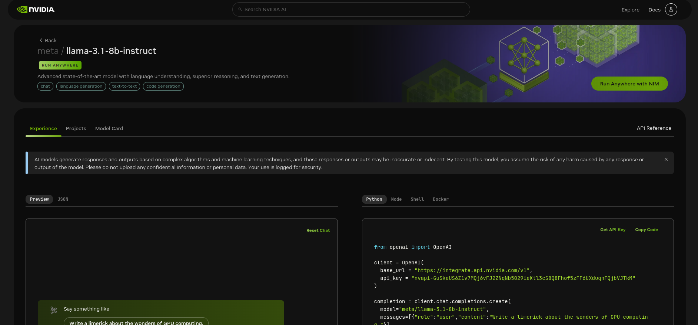

# **UNIDADE 7: Treinando Modelos LLMs**

7.1. Retrieval Augmented Generation  
7.2. Framework LangChain  
7.3. Llama 3  

# Orientação: Caso deseje executar o projeto Nvidia + Llama3 no Google Colab

Faça a importação do notebook e leve também o diretório **data**.

https://colab.research.google.com/

Descrição: Criar um motor de busca em documentos públicos recuperados do site do tribunal.

*  ouvidoria_tjdft.txt
*  sobre_nos.txt
*  canais_comunicacao.txt
*  cartilha_justica_comunitaria.txt
*  carta_servicos.txt
*  comite_distrital_saude.txt
*  atendimento_ao_cidadao.txt
*  regulamentacao.txt

Fontes:

https://www.tjdft.jus.br/ouvidoria

https://www.tjdft.jus.br/informacoes/cidadania/justica-comunitaria/publicacoes/arquivos/Cartilha_JusCom.pdf

# Configuração do ambiente para o projeto Nvidia + Llama3

### Passo 1:

Crie uma conta na Nvidia. Vá ao site da Nvidia https://build.nvidia.com/explore/discover e crie uma conta

### Passo 2:

Escolha o modelo que quer usar. No curso usaremos o **meta/llama-3.1-405b-instruct**

### Passo 3:

**Gere API Key** e coloque no **Secrets** do Google Colab.

Caso esteja executando no Google Colab configure a  **API Key**

Para poder usar a API Key no Google Colab:

*  Abra o Google Colab e vá para Secrets.
*  Digite o Nome e o Valor do segredo. Embora o Valor possa ser alterado, o Nome não pode ser alterado. Neste código sugiro NVIDIA_KEY, mas você pode alterar
*  Ative o acesso ao Notebook.
*  Finalmente, para usá-lo no notebook, use o código fornecido com o nome do seu segredo no lugar de <secretName>

# Configuração do ambiente para o projeto LMStudio + AnythingLLM

